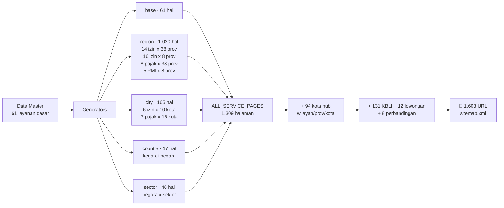
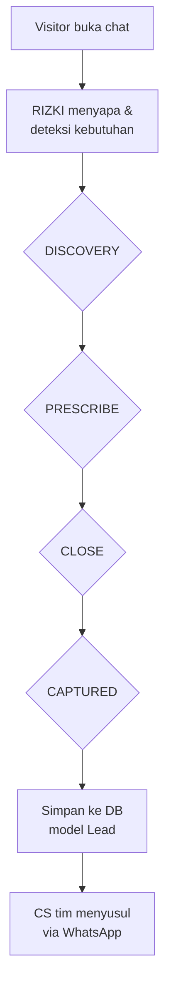
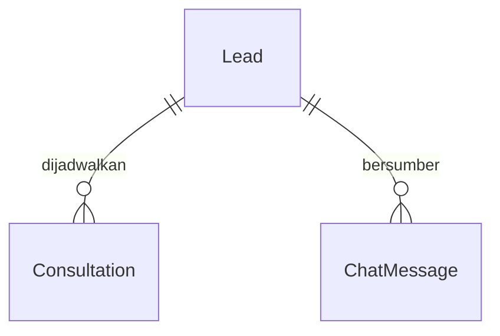

<div align="center">


# PusatPerizinan.com

### Mesin SEO Super Premium — Platform Jasa Perizinan #1 Indonesia

**1.603 halaman aktif · Skor kualitas 100/100 · Zero halaman kosong · Chat AI jualan otomatis 24/7**

[](https://nextjs.org)
[](https://typescriptlang.org)
[](https://tailwindcss.com)
[](https://prisma.io)
[](https://bun.sh)
[](https://ui.shadcn.com)
[](#-mesin-seo-1603-halaman)
[](#-metodologi-verifikasi)
[](#-metodologi-verifikasi)
[](#-rizki--konsultan-ai-247)
[](https://pusatperizinan.com/sitemap.xml)
[](#-mulai-dalam-60-detik)

</div>

---

## 🚀 TL;DR

```bash
bun install          # 30 detik
bun run db:push      # siapkan database SQLite
bun run dev          # buka http://localhost:3000
```

Satu perintah membangkitkan **1.603 halaman SEO** yang lolos audit kualitas **100/100**: setiap halaman punya konten unik, FAQ, JSON-LD, canonical, breadcrumb, dan internal-linking — tanpa satu pun halaman kosong (*thin content*).

---

## 📑 Daftar Isi

- [TL;DR](#-tldr)
- [Statistik Hero](#-statistik-hero)
- [Fitur God Mode](#-fitur-god-mode)
- [Mesin SEO 1.603 Halaman](#-mesin-seo-1603-halaman)
- [RIZKI — Konsultan AI 24/7](#-rizki--konsultan-ai-247)
- [Arsitektur Sistem](#-arsitektur-sistem)
- [Tech Stack](#-tech-stack)
- [Database](#-database)
- [API Reference](#-api-reference)
- [Struktur Proyek](#-struktur-proyek)
- [Mulai dalam 60 Detik](#-mulai-dalam-60-detik)
- [Konfigurasi](#-konfigurasi)
- [Keandalan](#-keandalan)
- [Metodologi Verifikasi](#-metodologi-verifikasi)
- [Roadmap](#-roadmap)
- [Lisensi](#-lisensi)

---

## 📊 Statistik Hero

| Metrik | Angka | Status |
|---|---|---|
| Halaman di sitemap live | **1.603** | ✅ terverifikasi `sitemap.xml` |
| Skor kualitas konten | **100/100** | ✅ audit statis 1.575 halaman |
| Halaman kosong/thin | **0** | ✅ |
| Duplikat title/desc/slug | **0** | ✅ |
| Klien | 1.247+ | di 38 provinsi |
| Izin terbit | 3.899+ | rating 4,9/5 |
| Jangkauan wilayah | 38 provinsi · 514 kab/kota | seluruh Indonesia |
| Negara tujuan PMI | 17 | jalur resmi UU 18/2017 |
| Lines of code | 31.196 | 132 file TS/TSX |
| Komponen UI | 74 | shadcn/ui New York |
| API routes | 8 | runtime nodejs |

---

## ✨ Fitur God Mode

| # | Fitur | Deskripsi |
|---|---|---|
| 1 | 🏭 **Mesin 1.603 halaman** | Generator deterministik layanan × provinsi × kota × negara × sektor — konten unik per kombinasi |
| 2 | 🤖 **RIZKI AI 24/7** | Chat konsultan senior yang jualan otomatis + capture lead ke database |
| 3 | 📸 **Cek Izin AI (VLM)** | Upload foto dokumen → vision model audit kelengkapan, status, dan langkah berikutnya |
| 4 | 🧮 **Kalkulator Pajak** | PPh 21/22/23, UMKM 0,5%, PPh final — interaktif, tanpa reload |
| 5 | 🗺️ **Roadmap Izin** | Wizard bertahap sesuai jenis usaha, tersimpan di database |
| 6 | 💼 **Lowongan + Google Jobs** | 12 lowongan PMI & kantor dengan `JobPosting` schema |
| 7 | ⚖️ **Perbandingan Badan Usaha** | 8 halaman PT vs CV vs UD dll dengan tabel komprehensif |
| 8 | 📚 **Database KBLI 2025** | 131 kode dengan risiko, izin, pajak, insentif + `DefinedTerm` schema |
| 9 | 🌐 **38 provinsi + 94 kota** | Halaman hub wilayah dengan interlinking provinsi ↔ kota ↔ layanan |
| 10 | 💰 **Pajak pribadi & korporat** | 16 layanan pajak dari NPWP sampai transfer pricing |
| 11 | 🛫 **PMI end-to-end** | 10 layanan B2C + 3 B2B + halaman negara & sektor kerja |
| 12 | 🎯 **Lead capture** | Form konsultasi di setiap halaman → WhatsApp + database |

---

## 🏭 Mesin SEO: 1.603 Halaman

### Breakdown sitemap live

| Kategori | Jumlah | Contoh URL |
|---|---|---|
| Halaman layanan | 1.313 | `/layanan/nib`, `/layanan/pt-dki-jakarta` |
| ┗ Hub kota | 94 | `/layanan/wilayah/jawa-barat/bandung` |
| ┗ Hub provinsi | 38 | `/layanan/wilayah/bali` |
| ┗ Hub kategori | 3 | `/layanan/kategori/pajak` |
| Database KBLI | 132 | `/kbli/01111-pertanian-padi` |
| Lowongan kerja | 13 | `/lowongan-kerja/perawat-lansia-jepang` |
| Perbandingan | 9 | `/bandingkan/pt-vs-cv` |
| Halaman utama | 4 | `/`, `/kalkulator-pajak`, `/roadmap`, `/cek-dokumen` |
| **Total** | **1.603** | |

### Anatomi generator



### Filosofi anti-penalti Google

1. **Konten unik per kombinasi** — bukan template nama-diganti: intro, FAQ, catatan provinsi, dan KBLI dominan berbeda tiap halaman.
2. **Setiap URL menjawab intent** — "biaya PT di Jawa Barat", "KBLI 01111", "kerja Jepang SSW" — keyword ada di URL, title, H1, dan jawaban.
3. **Structured data penuh** — `Service` + `Offer` + `AggregateRating`, `FAQPage`, `BreadcrumbList`, `DefinedTerm`, `JobPosting`.
4. **Internal linking rapi** — breadcrumbs 4 level, sibling kota, related layanan (6 link/halaman), hub ↔ spoke.
5. **Zero sia-sia** — semua URL di sitemap merespons 200, punya `lastmod`, dan konten ≥ 600 karakter.

---

## 🤖 RIZKI — Konsultan AI 24/7



- **Sistem prompt bisnis**:DISCOVERY → PRESCRIBE → CLOSE → CAPTURED — jualan, bukan basa-basi.
- **Fallback deterministik** — kalau AI down, chat tetap balas dengan jawaban templat yang berguna. Tidak pernah error 500.
- **Lead masuk database** langsung tercatat (`source: "chat"`).

---

## 🏗️ Arsitektur Sistem

```mermaid
flowchart TB
    subgraph Client["Browser"]
        UI[Landing + 1.603 halaman<br/>React 19 / Turbopack]
    end
    subgraph NextJS["Next.js 16 (port 3000)"]
        Pages[App Router<br/>catch-all [...slug]]
        API[8 API routes<br/>runtime nodejs]
        Gen[Catalog Engine<br/>generators.ts]
        Pages --> Gen
    end
    subgraph Data["Lapisan Data"]
        DB[(Prisma + SQLite<br/>8 model)]
        AI[z-ai-web-dev-sdk<br/>LLM + VLM — backend only]
    end
    UI -->|fetch relatif| API
    API --> DB
    API --> AI
```

---

## 🛠️ Tech Stack

| Lapisan | Teknologi | Alasan |
|---|---|---|
| Framework | **Next.js 16 App Router** | RSC + streaming + static export ready |
| Bahasa | **TypeScript 5 strict** | Tipe aman dari data → generator → render |
| Styling | **Tailwind CSS 4 + shadcn/ui** | Consistent design system, emerald/amber/stone |
| Ikon & animasi | lucide-react + framer-motion 12 | Ringan, halus |
| Database | **Prisma 6 + SQLite** | Zero-config, cocok deployment sederhana |
| Runtime | **Bun** | Dev server super cepat |
| AI | **z-ai-web-dev-sdk** (backend only) | LLM chat RIZKI + VLM cek dokumen |

---

## 🗄️ Database

8 model Prisma — alur utama: **Lead** (hasil chat/form) → **Consultation** (jadwal) → **ChatMessage** (riwayat RIZKI), plus **LicenseCheck**, **DocumentCheck**, **RoadmapRequest**, **Subscriber**, **Testimonial**.



```bash
bun run db:push   # push schema ke db/custom.db
```

---

## 📮 API Reference

| Method | Endpoint | Fungsi |
|---|---|---|
| GET | `/api/stats` | Statistik live klien & izin |
| POST | `/api/chat` | Chat RIZKI (AI LLM, capture lead) |
| POST | `/api/leads` | Simpan lead dari form konsultasi |
| POST | `/api/license-checker` | Cek izin yang dibutuhkan usaha |
| POST | `/api/document-checker` | VLM audit foto dokumen |
| POST | `/api/roadmap` | Simpan request roadmap |
| POST | `/api/subscribe` | Newsletter |
| GET | `/sitemap.xml` | 1.603 URL dinamis |

Contoh:

```bash
curl -X POST http://localhost:3000/api/chat \
  -H "Content-Type: application/json" \
  -d '{"messages":[{"role":"user","content":"Saya mau buka kafe di Bandung, perlu izin apa saja?"}]}'
```

---

## 📁 Struktur Proyek

```
src/
├── app/
│   ├── page.tsx                  # Landing (hero, layanan, RIZKI, form)
│   ├── layanan/
│   │   ├── [...slug]/page.tsx    # Catch-all 1.313 halaman + JSON-LD
│   │   └── hub-page.tsx          # Render hub kategori/provinsi/kota
│   ├── kbli/[...slug]/           # 131 kode KBLI + DefinedTerm schema
│   ├── lowongan-kerja/[slug]/    # JobPosting schema
│   ├── bandingkan/[slug]/        # Tabel perbandingan badan usaha
│   ├── kalkulator-pajak/         # Kalkulator interaktif
│   ├── cek-dokumen/              # VLM upload & audit
│   ├── roadmap/                  # Wizard roadmap izin
│   ├── api/                      # 8 route handlers
│   └── sitemap.ts                # Generator 1.603 URL + lastmod
├── lib/
│   ├── catalog/
│   │   ├── generators.ts         # ⭐ Mesin 1.309 halaman + 94 kota
│   │   ├── types.ts              # ServicePage, CATEGORY_META
│   │   └── detail-*.ts           # Konten kaya per layanan/negara
│   ├── coverage-data.ts          # 38 provinsi + 94 kota + catatan lokal
│   ├── kbli-catalog.ts           # 131 kode KBLI
│   └── landing-data.ts           # Brand, WA, harga
└── components/                   # 74 komponen (shadcn/ui + custom)
```

---

## ⚡ Mulai dalam 60 Detik

```bash
# 1. Install (±30s)
bun install

# 2. Database
bun run db:push

# 3. Jalankan
bun run dev
# → Local: http://localhost:3000

# 4. Verifikasi
curl -s localhost:3000/sitemap.xml | grep -c "<url>"   # → 1603
curl -s -o /dev/null -w "%{http_code}" localhost:3000/layanan/wilayah/jawa-barat/bandung  # → 200
bun run lint                                            # → 0 error
```

---

## ⚙️ Konfigurasi

| Yang diubah | File | Contoh |
|---|---|---|
| Nomor WhatsApp | `src/lib/landing-data.ts` → `WHATSAPP_NUMBER` | `6281269999910` |
| Harga layanan | `src/lib/landing-data.ts` → `SERVICES[].price` | `Rp 350 rb` |
| Prompt RIZKI | `src/app/api/chat/route.ts` → `SYSTEM_PROMPT` | gaya jualan |
| Kota provinsi | `src/lib/coverage-data.ts` → `PROVINCES[].majors` | tambah kota baru → halaman kota otomatis terbentuk |
| Brand & statistik | `src/lib/landing-data.ts` | 1.247 klien, 4,9/5 |

> 💡 Menambah satu kota di `majors` otomatis menciptakan: halaman kota hub + link balik dari provinsi + entri sitemap. Itulah kekuatan mesin programatik.

---

## 🛡️ Keandalan

| Risiko | Mitigasi |
|---|---|
| AI down / timeout | Fallback deterministik di semua endpoint — tidak pernah 500 |
| Payload ngawur | Validasi & parsing tangguh, rate limit per IP |
| Halaman kosong | Audit statis otomatis: skor 100/100, zero thin |
| Slug bentrok | Generator dedupe — 0 duplikat slug/title/desc |
| Memory dev server | `NODE_OPTIONS=--max-old-space-size=2048` + jangan crawl semua URL sekaligus |
| SEO canonical | Setiap halaman punya canonical + OG + Twitter card |

---

## 🔬 Metodologi Verifikasi

Semua angka di README ini **dihitung dari sistem yang berjalan**, bukan dikarang:

```bash
# Jumlah URL sitemap live
curl -s localhost:3000/sitemap.xml | grep -c "<url>"            # 1603

# Audit statis 1.575 halaman (title/metaDesc/FAQ/thin/duplikat)
bun -e "import('./src/lib/catalog/index.ts').then(async m => {
  const pages = m.ALL_SERVICE_PAGES;
  const bad = pages.filter(p => p.metaDesc.length > 320 || p.faq.length < 2);
  console.log(pages.length, 'halaman,', bad.length, 'masalah');   // 1309, 0
})"

# HTTP 200 sampel (throttled — jangan banjir dev server!)
curl -s -o /dev/null -w "%{http_code}" localhost:3000/layanan/wilayah/jawa-barat/bandung  # 200
curl -s -o /dev/null -w "%{http_code}" localhost:3000/layanan/tax-umkm-jawa-barat         # 200
```

> ⚠️ **Pelajaran produksi**: audit crawler WAJIB throttled (jeda ≥ 2 dtk per request). Menembak 1.603 URL tanpa jeda membuat dev server kompilasi on-demand kehabisan memori (OOM).

---

## 🗺️ Roadmap

- [x] **Fase 1** — Mesin 1.000+ halaman programatik
- [x] **Fase 2** — Tier 2: Lowongan, Perbandingan, AI Cek Dokumen
- [x] **Fase 3** — RIZKI AI 24/7 + capture lead
- [x] **Fase 4** — Pajak pribadi/korporat + konsultan PMI
- [x] **Fase 5** — Audit kualitas 100/100 + ekspansi 1.603 URL + 94 kota
- [ ] **Fase 6** — Dashboard admin lead monitoring real-time
- [ ] **Fase 7** — Follow-up email otomatis (engine idempoten)
- [ ] **Fase 8** — Kalkulator biaya per provinsi + review programatik

---

## 📄 Lisensi

Proyek komersial milik **PusatPerizinan.com**. Dilarang mendistribusikan tanpa izin.

---

<div align="center">

**PusatPerizinan.com** — *Urus Semua Izin Usaha, Tinggal Terima Beres*

Indonesia Stock Exchange Building, Tower 2, Lantai 5, SCBD Lot 13, Jakarta Selatan

[](https://wa.me/6281269999910)

⭐ **1.603 halaman · Skor 100/100 · Zero halaman kosong** ⭐

</div>
