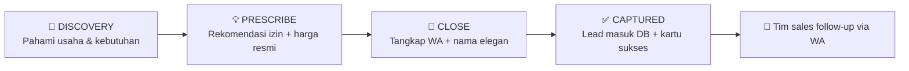
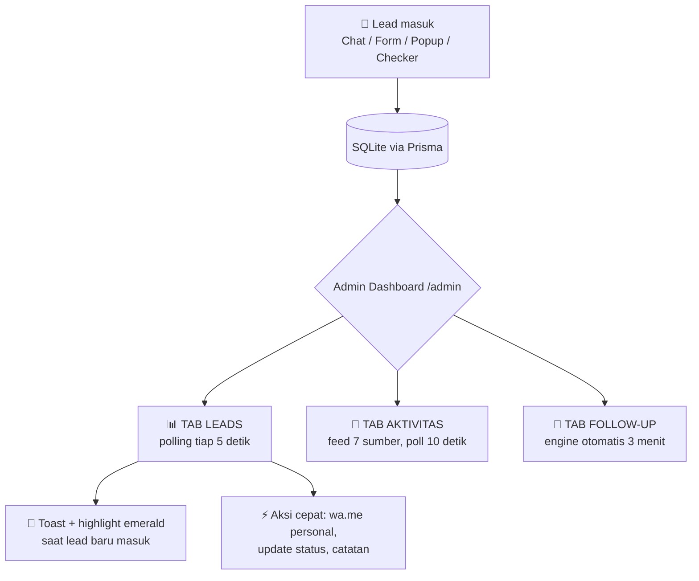
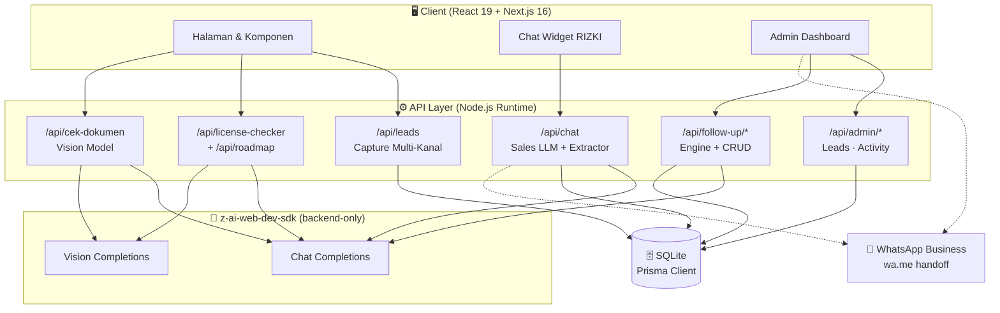
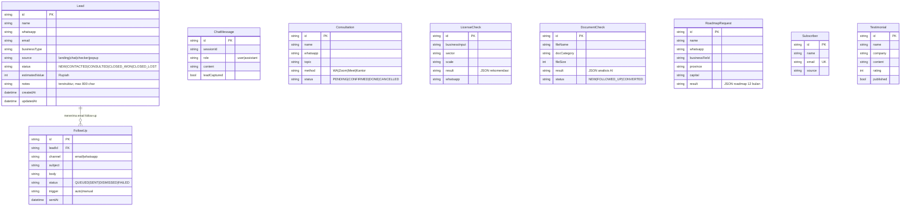
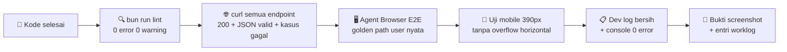

<div align="center">


# 🏛️ PUSATPERIZINAN.COM

### *Platform Perizinan Usaha #1 Indonesia — Didukung AI, Dipimpin Data, Digaransi*

**1.169 halaman SEO programatik · AI Sales Chat 24/7 · Admin Command Center real-time · Follow-Up Engine otomatis**


**[🚀 Fitur](#-fitur-unggulan-god-mode) · [🏗️ Arsitektur](#-arsitektur-sistem) · [🔌 API](#-api-reference) · [🗺️ SEO](#-mesin-seo-programatik) · [⚡ Mulai Cepat](#-mulai-cepat) · [📖 Konfigurasi](#-konfigurasi--kustomisasi)**

</div>

---

> 🎯 **TL;DR** — Ini bukan sekadar website company profile. Ini adalah **mesin akuisisi klien otomatis**: AI menjual 24/7, setiap percakapan menangkap lead ke database, dashboard admin memantau lead *real-time*, dan engine follow-up memanaskan lead yang dingin secara otomatis — semua di atas fondasi **1.169 halaman SEO programatik** yang membanjiri Google untuk ribuan kata kunci perizinan.

---

## 📖 Daftar Isi

| # | Bagian | Isi |
|---|--------|-----|
| 1 | [✨ Tentang Proyek](#-tentang-proyek) | Cerita, angka, dan filosofi |
| 2 | [🚀 Fitur Unggulan](#-fitur-unggulan-god-mode) | 12 fitur god mode lengkap |
| 3 | [🏗️ Arsitektur Sistem](#-arsitektur-sistem) | Diagram alur end-to-end |
| 4 | [🧱 Tech Stack](#-tech-stack) | Teknologi & alasan memilihnya |
| 5 | [📊 Skema Database](#-skema-database) | 9 model Prisma + ER diagram |
| 6 | [🔌 API Reference](#-api-reference) | 14 endpoint terdokumentasi |
| 7 | [🗺️ Mesin SEO Programatik](#-mesin-seo-programatik) | Anatomi 1.169 halaman |
| 8 | [📁 Struktur Proyek](#-struktur-proyek) | Peta file lengkap |
| 9 | [⚡ Mulai Cepat](#-mulai-cepat) | Jalan dalam 60 detik |
| 10 | [🔧 Konfigurasi](#-konfigurasi--kustomisasi) | Kustom WA, harga, PIN, dll |
| 11 | [🛡️ Keandalan & Keamanan](#-keandalan--keamanan) | Fallback, rate limit, verifikasi |
| 12 | [✅ Verifikasi Kualitas](#-verifikasi-kualitas) | Metodologi E2E yang dipakai |
| 13 | [🚦 Roadmap](#-roadmap) | Rencana berikutnya |
| 14 | [📄 Lisensi](#-lisensi) | Ketentuan penggunaan |

---

## ✨ Tentang Proyek

<div align="center">

> *"Legalitas usaha seharusnya semudah memesan kopi. Kami membangun platform yang membuat setiap pemilik usaha Indonesia — dari warung di Ambon sampai korporasi di SCBD — bisa memahami dan mengurus izinnya tanpa stres."*

</div>

PusatPerizinan.com adalah platform full-stack untuk **konsultan perizinan usaha nomor 1 Indonesia** yang menggabungkan tiga dunia:

| Dunia | Implementasi di Proyek Ini |
|-------|---------------------------|
| 📣 **Marketing Engine** | 1.169 halaman programatik yang menargetkan ribuan long-tail keyword ("jasa izin X di Y", "biaya KBLI Z", "PT vs CV", "gaji perawat di Jepang") |
| 🤖 **AI Sales Machine** | Konsultan virtual **RIZKI** yang menjual otomatis 24/7, memahami niat, menawarkan harga dari menu resmi, dan menangkap lead tanpa terasa memaksa |
| 🎛️ **Ops Command Center** | Dashboard admin real-time dengan pipeline tracking, activity feed 7 sumber, dan follow-up engine AI yang menghidupkan kembali lead dingin |

<div align="center">

| 🏢 | 📈 | ⭐ | 💼 |
|:---:|:---:|:---:|:---:|
| **1.251** | **3.899+** | **4,9/5** | **100%** |
| klien terbantu | izin berhasil diproses | rating kepuasan | garansi uang kembali |

📍 Kantor Pusat: Indonesia Stock Exchange Building, Tower 2 Lantai 5, SCBD Lot 13, Jakarta Selatan

</div>

---

## 🚀 Fitur Unggulan (God Mode)

### 1️⃣ 🗺️ Mesin SEO Programatik — 1.169 Halaman, Satu Sumber Data

> *"Tidak peduli meskipun harus membuat 1000 halaman."* — selesai di angka 1.169.

Sebuah generator (`src/lib/catalog/generators.ts`) membangun **965 halaman layanan** dari matriks data terstruktur: jenis izin × wilayah × varian. Setiap halaman punya konten unik, FAQ, JSON-LD, dan breadcrumb — **bukan doorway page**, tapi halaman yang benar-benar menjawab intent.

```
src/lib/catalog/
├── types.ts            → Kontrak data ServicePage (desc wajib, tanpa placeholder)
├── detail-licenses.ts  → 19 izin detail + peta panduan
├── detail-tax-pmi.ts   → 16 pajak + 13 jasa PMI + 17 negara tujuan
├── generators.ts       → Engine builder 965 halaman + FAQ dinamis
├── comparisons.ts      → 12 perbandingan badan usaha (fakta regulasi resmi)
└── index.ts            → Lookup & relasi antar halaman
```

**Contoh matriks yang dihasilkan:**

| Jenis Halaman | Formula | Contoh Slug |
|---------------|---------|-------------|
| Izin × Provinsi | 19 izin × 38 provinsi | `/layanan/pendirian-pt/jawa-barat` |
| Pajak detail | 16 halaman | `/layanan/pengurusan-pajak/pph-badan` |
| PMI × Negara | 13 jasa × 17 negara | `/layanan/pmi/perawat-jepang` |
| KBLI detail | 131 kode | `/kbli/56101-usaha-restoran` |
| Perbandingan | 12 duel | `/perbandingan/pt-vs-cv` |
| Lowongan | 12 posisi | `/lowongan/perawat-lansia-jepang` |

Setiap halaman dilengkapi **JSON-LD ganda** (`Service`, `FAQPage`, `BreadcrumbList`, `JobPosting`, `Article`) + `sitemap.ts` dinamis yang menghasilkan **1.169 URL** dalam satu build.

---

### 2️⃣ 🤖 AI Chat "RIZKI" — Mesin Penjualan Otomatis 24/7

Bukan chatbot FAQ biasa. RIZKI adalah **sales consultant AI** dengan metodologi penjualan terstruktur:



**Kenapa RIZKI berbeda:**

- 💰 **Anti-halusinasi harga** — angka HANYA dari `PRICE_MENU` (9 item resmi: NIB UMKM 350rb s/d PMA mulai 15jt). AI tidak bisa mengarang harga
- 🧠 **Metodologi 4 tahap** (DISCOVERY → PRESCRIBE → CLOSE → CAPTURED) dengan *objection handling* berpola empati → reframe → bukti → CTA
- 🎯 **Deteksi intent rule-based** + klasifikasi topik (PMA/PT/CV/NIB/Halal/BPOM/PBG/Pajak/KBLI)
- 🔗 **Cross-sell cerdas** — mengarahkan ke 6 tool internal (Roadmap, Kalkulator Pajak, KBLI, Perbandingan, Cek Dokumen, Lowongan)
- 🛡️ **Lead capture berlapis**: extractor LLM (nama/WA/bidang/stage/urgency) + *regex safety net* verbatim (anti-salah-digit) + heuristik nama
- ⚖️ **Lead upsert kaya** — lead lama di-update (nilai estimasi dinaikkan via `Math.max`, notes di-append), tidak pernah duplikat
- 🌐 **Bilingual** — auto-detect, quick replies dalam Bahasa Indonesia & English
- ⏱️ **Tangguh**: timeout LLM 60 detik → fallback deterministik tanpa error 500 · rate limit 25 pesan/10 menit · riwayat chat rebuild dari DB lintas restart

> ✅ **Terverifikasi E2E di browser nyata**: teaser proaktif muncul → tanya "berapa biaya pendirian PT?" → jawaban menyebut "mulai dari Rp 3,5 jt" → submit nama + WA → lead **Andi Pratama** tersimpan di database dengan klasifikasi bidang otomatis "Retail".

---

### 3️⃣ 🎛️ Admin Command Center — Lead Monitoring Real-Time

Akses: **`/admin`** (PIN demo: `123456` · `noindex` · disclaimer NextAuth untuk produksi)



**Tab Leads:**
- 5 kartu metrik pipeline: Total Lead · Lead Hari Ini · Pipeline Aktif · **Nilai Pipeline** (format "Rp X,X jt") · Closed Won
- Pencarian debounced 300ms + filter status (5 tahap) + filter sumber
- Tabel sticky-header: nomor WA terformat `+62 812-9876-5432`, umur lead relatif ("2 jam lalu"), badge status berwarna
- **Polling 5 detik** dengan deteksi `document.hidden` (hemat resource), lead baru = highlight fade + toast
- Sheet detail: ubah status inline, catatan dengan counter 2000 karakter, tombol **Chat WhatsApp** dengan pesan personal otomatis

**Tab Aktivitas:** feed gabungan 7 sumber — Chat AI · Pencarian Izin · Cek Dokumen · Roadmap · Subscriber · Konsultasi · Lead Baru — dengan ikon & waktu relatif.

---

### 4️⃣ 💌 Follow-Up Engine — Menghidupkan Lead yang Dingin

Lead yang tidak closing bukanlah lead mati — hanya butuh dikontak lagi di momen yang tepat.

| Aspek | Implementasi |
|-------|--------------|
| 🎯 **Kandidat** | Status `NEW`/`CONTACTED`/`CONSULTED` + lebih dari `staleHours` tanpa aktivitas + belum punya antrean aktif |
| 🧠 **Konten** | Email personal yang *di-generate LLM* per-lead: menyebut nama, kebutuhan spesifik, tool internal yang relevan, CTA WA — dengan **fallback deterministik** jika AI gagal |
| 🛡️ **Anti-spam** | Cooldown 48 jam per lead + skip lead yang punya `QUEUED` aktif + guard antrean maks 50 + idempotent (panggil ulang = `skipped`) |
| 📬 **Pengiriman** | Admin kirim via `mailto:` / `wa.me` dari panel, atau copy satu klik → status tercatat (`SENT` + `sentAt`) |
| ⏰ **Otomatis** | Switch auto-run tiap 3 menit (persist per session) + tombol manual "Proses Lead Sekarang" |

> ✅ **Terverifikasi**: engine memproses 2 lead stale → draft email personal dengan subject kontekstual → panggil ulang → `skipped 2` (idempotence terbukti) → `PATCH` ke `SENT` mengisi `sentAt`.

---

### 5️⃣ 🔍 AI License Checker — "Usahaku Butuh Izin Apa?"

Pengguna mengetik deskripsi usaha bebas (*"aku mau buka kafe di Bandung sambil jual kopi bubuk online"*), AI mengidentifikasi **sektor, skala, dan daftar izin yang dibutuhkan** lengkap dengan alur — lalu menangkap WA saat pengguna mengambil hasil. Log tersimpan di `LicenseCheck` dan muncul di activity feed admin.

### 6️⃣ 🧭 AI Roadmap Generator — Rencana Perizinan 12 Bulan

Wizard interaktif (bidang usaha → provinsi → skala → modal → rencana) → AI menyusun **roadmap perizinan berjenjang 12 bulan** — dari legalitas dasar sampai kesiapan ekspor. Input tercatat sebagai *lead premium* di `RoadmapRequest`.

### 7️⃣ 📸 AI Cek Dokumen — Vision Model Menganalisis Foto Dokumen

Upload foto dokumen (NPWP, NIB, KTP, paspor, sertifikat standar, izin edar, kontrak — 8 kategori) → **VLM (Vision Language Model)** menganalisis kelengkapan & kejelasan dokumen → skor + checklist perbaikan + CTA WA untuk bantuan lanjutan.

- Client-side: gambar di-resize canvas 1600px / JPEG 0.85 sebelum dikirim (hemat bandwidth)
- Backend: pola `createVision()` teruji, prompt checklist per-tipe dokumen, parsing tangguh
- **Tanpa menyimpan data pribadi mentah** — hanya hasil analisis di `DocumentCheck`

### 8️⃣ 🧮 Kalkulator Pajak Interaktif

Simulasi PPh final UMKM (`0,5%` per PP 55/2022), PPh Badan (`22%`), NPWP/NIK, pajak daerah — dengan tarif yang didokumentasikan per regulasi resmi di halaman detail pajak.

### 9️⃣ 📚 Browser KBLI 2025

131 kode KBLI valid dalam 17 kategori (A–S) dengan halaman detail lengkap per kode: **tingkat risiko** (rendah s/d tinggi), izin turunannya, catatan pajak, insentif, FAQ, dan keterkaitan antar KBLI + link ke layanan terkait — semuanya programatik.

### 🔟 💼 Pusat Karir — Lowongan PMI & Kantor + Google Jobs Schema

12 lowongan terverifikasi (6 penempatan PMI internasional: Jepang 🇯🇵, Korea 🇰🇷, Arab Saudi 🇸🇦, Taiwan 🇹🇼, Jerman 🇩🇪, Malaysia 🇲🇾 + 6 posisi kantor) dengan **JSON-LD `JobPosting`** lengkap — memenuhi syarat muncul di **Google Jobs**, plus disclaimer anti-human-trafficking di setiap halaman.

### 1️⃣1️⃣ ⚖️ Perbandingan Badan Usaha — Konten Programatik Berkualitas

12 duel mendalam (`PT vs CV`, `PT vs Perorangan`, `PMA vs PT Lokal`, `Yayasan vs Perkumpulan`, ...) dengan tabel perbandingan 10+ aspek, fakta regulasi akurat (UU 40/2007, UU 6/2023, PP 55/2022, PMK 128/2019, PMK 168/2023, BKPM 5/2021), FAQ 6+ pertanyaan, dan CTA kontekstual.

### 1️⃣2️⃣ 🧲 Lead Capture Multi-Kanal

Setiap interaksi adalah pintu masuk lead:

| Kanal | Titik Tangkap | Sumber di DB |
|-------|---------------|--------------|
| 💬 Chat AI RIZKI | Deteksi nomor WA dalam percakapan | `chat` |
| 🧲 Hero form & popup landing | Form konsultasi gratis | `landing` / `popup` |
| 🔍 License Checker | WA saat mengambil hasil | `checker` |
| 📧 Kursus email 7 hari | Form subscribe | `email-course` |
| 📅 Booking konsultasi | Form jadwal (WA/Zoom/Kantor) | `consultation` |

---

## 🏗️ Arsitektur Sistem



**Prinsip arsitektur:**
1. **Server components by default** — client components hanya untuk interaktivitas (chat, dashboard, wizard, browser)
2. **AI SDK hanya di backend** — `z-ai-web-dev-sdk` tidak pernah dieksekusi di client
3. **Fallback tanpa batas** — setiap pemanggilan LLM punya timeout + fallback deterministik; API tidak pernah 500 karena AI
4. **Pemisahan data & generator** — konten SEO = data terstruktur di `src/lib/*`, halaman = generator murni

---

## 🧱 Tech Stack

| Layer | Teknologi | Kenapa |
|-------|-----------|--------|
| **Framework** | Next.js 16 (App Router) | Server components, streaming, metadata API, programmatic routing via `[...slug]` |
| **Bahasa** | TypeScript 5 (strict) | Type-safety penuh dari data katalog sampai response API |
| **UI** | React 19 + shadcn/ui (New York) + lucide-react | Komponen aksesibel, konsisten, mudah di-theme |
| **Styling** | Tailwind CSS 4 | Utility-first, palet brand `emerald/amber/stone` — tanpa biru/indigo |
| **Animasi** | framer-motion 12 | Teaser chat spring, fade lead baru, micro-interactions |
| **Database** | Prisma 6 + SQLite | Zero-config, cepat, cocok untuk lead-gen; siap migrasi ke Postgres |
| **AI** | z-ai-web-dev-sdk | LLM (chat + extractor + email) & VLM (cek dokumen) via satu SDK |
| **State client** | React hooks + sessionStorage | Polling & persist ringan tanpa dependency tambahan |
| **Toast** | sonner | Notifikasi elegan (lead baru, status tersimpan) |
| **Runtime** | Bun | `bun run dev` super cepat dengan log ter-te ke `dev.log` |
| **Linter** | ESLint 9 + eslint-config-next | Standar 0 error 0 warning |

---

## 📊 Skema Database

9 model Prisma yang saling terhubung — dirancang sebagai **aset bisnis**: setiap tabel adalah kekayaan data yang bisa di-follow-up.



<details>
<summary>📎 <b>Desain skema yang layak dicatat</b></summary>

- **`Lead.status`** — pipeline 5 tahap yang dipakai lintas fitur: dashboard (badge + filter), follow-up engine (kandidat = belum closing), dan stat pipeline
- **`FollowUp.onDelete: Cascade`** — data uji bisa dibersihkan lewat lead tanpa orphan
- **Index strategis** — `status`, `createdAt`, `sessionId`, `leadId` karena pola query dashboard (filter + sort + groupBy berjalan paralel via `Promise.all`)
- **`estimatedValue` sebagai int Rupiah** — dashboard format ke "Rp 20,5 jt" untuk ringkasan & nilai penuh untuk detail
- **Notes append pattern** — chat engine men-append `" || "` maks 800 char, menjaga riwayat interaksi tanpa model tambahan
</details>

---

## 🔌 API Reference

Semua endpoint `runtime = "nodejs"`, JSON in/out, dengan validasi ketat & parsing tangguh.

| Method | Endpoint | Fungsi | Catatan |
|--------|----------|--------|---------|
| `GET` | `/api` | Health check | — |
| `POST` | `/api/chat` | 💬 Chat RIZKI + lead capture | Rate limit 25/10 menit · timeout 60s · fallback deterministik |
| `POST` | `/api/leads` | 🧲 Simpan/update lead | Upsert by WA · multi-sumber |
| `POST` | `/api/license-checker` | 🔍 Rekomendasi izin via AI | Fallback rule-based |
| `POST` | `/api/roadmap` | 🧭 Roadmap 12 bulan via AI | Tersimpan sebagai lead premium |
| `POST` | `/api/cek-dokumen` | 📸 Analisis foto dokumen via VLM | Base64 image · resize client-side |
| `GET` | `/api/stats` | 📈 Statistik agregat publik | — |
| `POST` | `/api/subscribe` | 📧 Kursus email 7 hari | Unique email |
| `GET` | `/api/admin/leads` | 📊 List lead + summary pipeline | Filter `q`/`status`/`source` · limit max 200 · 6 query paralel |
| `PATCH` | `/api/admin/leads/[id]` | ✏️ Update status/catatan lead | Whitelist status · 400/404 jelas |
| `GET` | `/api/admin/activity` | 📡 Feed aktivitas 7 sumber | Sort desc · slice 40 |
| `POST` | `/api/follow-up/process` | 💌 Jalankan engine follow-up | Param `staleHours`, `maxPerRun` · idempotent |
| `GET` | `/api/follow-up` | 📋 List draft + statistik antrean | Include lead |
| `PATCH` | `/api/follow-up/[id]` | ✅ `SENT`/`DISMISSED`/`FAILED` | Set `sentAt` otomatis |

<details>
<summary>🧪 <b>Contoh: memicu engine follow-up manual</b></summary>

```bash
# Proses lead yang stale lebih dari 24 jam, maksimal 3 per run
curl -X POST http://localhost:3000/api/follow-up/process \
  -H "Content-Type: application/json" \
  -d '{"staleHours": 24, "maxPerRun": 3}'

# Respons
{
  "success": true,
  "processed": 2,
  "skipped": 1,
  "items": [
    { "lead": "Budi Santoso", "subject": "Pertanyaan seputar perizinan, Kak Budi?", "status": "QUEUED" }
  ]
}
```
</details>

---

## 🗺️ Mesin SEO Programatik

### Anatomi 1.169 URL

| Blok | URL | Sumber Data |
|------|-----|-------------|
| Halaman layanan programatik | **965** (+ hub) | `catalog/generators.ts` — matriks izin × provinsi × varian |
| KBLI detail | **131** (+ index) | `kbli-catalog.ts` — 131 kode × 17 kategori |
| Perbandingan badan usaha | **12** (+ index) | `catalog/comparisons.ts` |
| Lowongan kerja | **12** (+ index) | `jobs.ts` — 6 PMI + 6 kantor |
| Halaman statis (`/`, `/roadmap`, `/kalkulator-pajak`, `/cek-dokumen`, ...) | sisanya | Hand-crafted |

### Stack On-Page

- ✅ **JSON-LD per tipe konten**: `Service` + `FAQPage` + `BreadcrumbList` (layanan) · `JobPosting` (lowongan) · `Article` + `FAQPage` (perbandingan)
- ✅ **`sitemap.ts` dinamis** — satu sumber kebenaran, terbukti `1.169 <url>` di `sitemap.xml` live
- ✅ **Metadata API Next.js 16** — title/description unik per halaman, canonical, OpenGraph
- ✅ **Internal linking** otomatis: sibling service, kategori induk, KBLI terkait, CTA lintas-halaman
- ✅ **E-E-A-T signals**: disclaimer jalur resmi, otoritas regulasi disebut (OSS-RBA, Kemenkumham, DPMPTSP), garansi tertulis
- ✅ **HTML sitemap** di footer untuk crawl depth merata
- ✅ `/admin` → `robots: noindex, nofollow`

### Filosofi Anti-Penalti

> Programatik ≠ spam. Setiap halaman punya: deskripsi lokal yang ditulis dari data wilayah nyata, FAQ yang menjawab pertanyaan spesifik lokasi/jasa, harga transparan, dan jalur internal-link yang logis. Tidak ada halaman kosong yang hanya berisi keyword swap.

---

## 📁 Struktur Proyek

```
pusatperizinan/
├── prisma/
│   └── schema.prisma              # 9 model: Lead, FollowUp, ChatMessage, ...
├── public/
│   ├── logo.png / logo.svg        # Aset brand
│   ├── robots.txt                 # Crawl rules
│   └── manifest.json              # PWA metadata
├── scripts/
│   ├── build-static.mjs           # Export statis opsional
│   └── deploy-pack.mjs            # Packaging deploy
├── src/
│   ├── app/
│   │   ├── page.tsx               # Landing page utama
│   │   ├── layout.tsx             # Root layout + theme
│   │   ├── sitemap.ts             # Generator 1.169 URL ✅
│   │   ├── not-found.tsx          # 404 brand-consistent
│   │   ├── admin/                 # 🎛️ Command Center (noindex)
│   │   ├── api/                   # 14 route handlers (lihat API Reference)
│   │   ├── cek-dokumen/           # 📸 Vision document checker
│   │   ├── kbli/                  # 📚 Browser + halaman detail KBLI
│   │   ├── kalkulator-pajak/      # 🧮 Kalkulator interaktif
│   │   ├── layanan/[...slug]/     # 🗺️ 965 halaman programatik
│   │   ├── lowongan/              # 💼 Karir + Google Jobs schema
│   │   ├── perbandingan/          # ⚖️ 12 duel badan usaha
│   │   └── roadmap/               # 🧭 AI roadmap wizard
│   ├── components/
│   │   ├── admin/                 # admin-dashboard, follow-up-panel
│   │   ├── landing/               # hero, chat-widget, footer, ...
│   │   └── ui/                    # 50+ komponen shadcn/ui
│   └── lib/
│       ├── catalog/               # ⚙️ Mesin generator SEO
│       ├── chat-sales.ts          # 🤖 Otak sales RIZKI (menu, stage, intent)
│       ├── kbli-catalog.ts        # Katalog + generator KBLI
│       ├── kbli-database.ts       # Raw data 131 kode KBLI
│       ├── jobs.ts                # Data lowongan
│       ├── landing-data.ts        # Konten landing + WHATSAPP_NUMBER
│       └── db.ts                  # Prisma client singleton
└── worklog.md                     # 📓 Riwayat kerja seluruh agent
```

**Skala proyek:** 36.820 baris kode · 143 file TypeScript · 76 komponen · 14 API routes · 9 model database.

---

## ⚡ Mulai Cepat

### Prasyarat

- **Bun** ≥ 1.1 (atau Node.js ≥ 20)
- Kredensial AI (`z-ai-web-dev-sdk` sudah terkonfigurasi di lingkungan sandbox)

### 60 Detik Menuju Running

```bash
# 1️⃣ Install dependencies
bun install

# 2️⃣ Push schema ke database SQLite
bun run db:push

# 3️⃣ Jalankan dev server (port 3000, log → dev.log)
bun run dev
```

Buka `http://localhost:3000` → landing page · `http://localhost:3000/admin` → dashboard (PIN: `123456`).

### Verifikasi Instalasi

```bash
bun run lint                              # harus: 0 error 0 warning
curl -s localhost:3000/sitemap.xml | grep -c '<url>'   # harus: 1169
curl -s -X POST localhost:3000/api/chat \
  -H 'Content-Type: application/json' \
  -d '{"message":"Halo, izin apa yang saya butuhkan?","sessionId":"test-1"}'  # harus success
```

---

## 🔧 Konfigurasi & Kustomisasi

Semua "knob" bisnis berada di file data — tanpa perlu menyentuh logika:

| Apa | File | Kunci |
|-----|------|-------|
| 📱 Nomor WhatsApp | `src/lib/landing-data.ts` | `WHATSAPP_NUMBER`, `WHATSAPP_DISPLAY` |
| 🏢 Identitas kantor | `src/lib/landing-data.ts` | `OFFICE_NAME`, `OFFICE_ADDRESS` |
| 💰 Menu harga chat AI | `src/lib/chat-sales.ts` | `PRICE_MENU` (9 item) |
| 🎬 Script stage penjualan | `src/lib/chat-sales.ts` | `SUGGESTIONS_BY_STAGE`, `TOOL_LINKS` |
| 🆕 Jasa izin baru | `src/lib/catalog/` | Tambah entri → halaman otomatis ter-generate |
| 💼 Lowongan baru | `src/lib/jobs.ts` | `JOBS` → halaman + sitemap + Google Jobs otomatis |
| ⚖️ Perbandingan baru | `src/lib/catalog/comparisons.ts` | `COMPARISONS` |
| 📚 Kode KBLI baru | `src/lib/kbli-database.ts` | `KBLI_RAW` |
| 🔐 PIN dashboard | `src/components/admin/admin-dashboard.tsx` | Konstanta PIN (demo) — produksi: pasang NextAuth |
| 🤖 Kepribadian RIZKI | `src/app/api/chat/route.ts` | `SYSTEM_PROMPT` |
| ✉️ Gaya email follow-up | `src/app/api/follow-up/process/route.ts` | `SYSTEM_EMAIL_PROMPT` |

---

## 🛡️ Keandalan & Keamanan

| Ancaman | Mitigasi |
|---------|----------|
| LLM timeout/gagal (429/500) | `Promise.race` timeout 60s/45s/30s → **fallback deterministik** → API tetap `200`, UX tidak pernah broken |
| AI mengarang harga | Hanya `PRICE_MENU` resmi yang boleh disebut; prompt melarang angka di luar menu |
| AI salah salin nomor WA | Prioritas regex verbatim dari teks user → extractor → regex transkrip |
| Spam chat | Rate limit in-memory 25 pesan/10 menit per sesi + respons sopan mengarahkan ke WA |
| Lead duplikat | Upsert by nomor WA + `Math.max` untuk nilai estimasi + append notes |
| Follow-up spam | Cooldown 48 jam + skip antrean aktif + guard antrean >50 + idempotent |
| Data pribadi dokumen | VLM hanya menyimpan hasil analisis, bukan gambar/data mentah |
| Halaman admin terindeks | `metadata.robots: noindex, nofollow` + PIN gate (demo) — produksi wajib NextAuth |
| Memori server | Higiene otomatis: purge percakapan lama, cleanup bucket rate limit |
| Kehilangan konteks dev | Log terpusat di `dev.log`, riwayat kerja di `worklog.md` |

---

## ✅ Verifikasi Kualitas

Setiap fitur melewati gerbang verifikasi berlapis sebelum dinyatakan selesai:



**Sudah diverifikasi E2E di browser nyata (bukan sekadar build sukses):**
- ✅ Landing page render penuh + chat widget hidup (desktop & mobile)
- ✅ RIZKI: tanya harga → jawab menu resmi → submit WA → lead masuk DB → kartu sukses
- ✅ Dashboard: polling 5 detik terbukti (timestamp berganti), lead baru muncul + toast, update status & catatan tersimpan
- ✅ Follow-up: engine memproses lead stale, idempotent saat dipanggil ulang, draft email tampil lengkap di panel
- ✅ Sitemap 1.169 URL · responsive 390px tanpa overflow · sticky footer · console bersih

---

## 🚦 Roadmap

- [x] **Fase 1** — Clone, rebuild, stabilisasi proyek
- [x] **Fase 2** — Katalog layanan lengkap (pajak, PMI/TKI, hulu-hilir)
- [x] **Fase 3** — 1.169 halaman SEO programatik + sitemap dinamis
- [x] **Fase 4** — Tier 2: Lowongan Google Jobs · Perbandingan Badan Usaha · AI Cek Dokumen (Vision)
- [x] **Fase 5** — AI Chat CS "RIZKI" Sales Machine 24/7 + lead capture berlapis
- [x] **Fase 6** — Admin Command Center real-time + Follow-Up Engine otomatis
- [ ] **Fase 7 (opsi)** — Kalkulator biaya pendirian interaktif per provinsi
- [ ] **Fase 8 (opsi)** — Testimoni & studi kasus programatik
- [ ] **Produksi** — NextAuth untuk dashboard, SMTP resmi untuk pengiriman email, migrasi Postgres, domain + indexing

---

## 🤝 Konvensi Kontribusi

1. **Baca `worklog.md` dulu** — riwayat keputusan tiap fitur ada di sana
2. Ikuti palet brand: `emerald / amber / stone` — hindari biru/indigo
3. Gunakan komponen shadcn/ui yang sudah ada (`src/components/ui/`) sebelum membuat baru
4. API baru: `runtime = "nodejs"`, validasi input, respons tangguh (tidak ada 500 dari AI)
5. Konten SEO: lewat file data di `src/lib/`, biarkan generator yang bekerja
6. Sebelum merge: `bun run lint` harus 0/0 + uji golden path manual

---

## 📄 Lisensi

Proyek ini adalah properti pribadi **PusatPerizinan.com** — dibangun untuk operasional bisnis konsultan perizinan. Penggunaan kode, konten, atau data tanpa izin tertulis tidak diperkenankan.

---

<div align="center">

---

### 🏛️ PUSATPERIZINAN.COM — *Izin Terbit, Bisnis Jalan.*

**Indonesia Stock Exchange Building, Tower 2, Lantai 5, SCBD Lot 13**
Jl. Jend. Sudirman Kav. 52-53, Jakarta Selatan 12190

📞 WhatsApp: [0812-6999-9910](https://wa.me/6281269999910)

<sub>1.251 klien terbantu · 3.899+ izin terbit · rating 4,9/5 · garansi uang kembali 100%</sub>

<sub>⬆️ <a href="#-pusatperizinancom">Kembali ke atas</a></sub>

</div>
